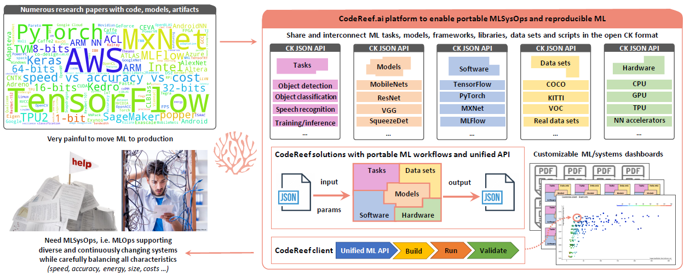

# Introduction

## What is CodeReef?

**[CodeReef](https://CodeReef.ai/portal)** is an open platform to share and interconnect all the AI/ML/systems components 
(models, data sets, packages, scripts) from research projects in the [common CK format](https://github.com/ctuning/ck)
required to enable portable, customizable and reproducible AI/ML workflows.

**[CodeReef solution](https://CodeReef.ai/portal/search/?q=%22codereef-solution%22)** 
is a new way to package and share ML models 
as [file-based "Collective Knowledge" databases](https://github.com/ctuning/ck) 
with all above components, Python APIs with JSON input/output,
and JSON meta descriptions.

**[CodeReef client / CodeReef SDK](https://github.com/codereef-ai/client)** is a small open-source Python library (Apache2 license) 
with a simple command line interface to automatically initialize, build, [crowd-benchmark](https://CodeReef.ai/portal/c/cr-result), 
test and customize CodeReef solutions with ML models across diverse platforms, AI frameworks, libraries, compilers and data sets.

**[CodeReef demo](https://CodeReef.ai/demo)** is our interactive live demo of the CodeReef solution 
and the CodeReef client to automatically build, run and [crowd-benchmark](https://codereef.ai/portal/c/cr-result/sota-mlperf-object-detection-v0.5-crowd-benchmarking/) 
object detection based on [SSD-Mobilenets, TensorFlow and COCO dataset](https://codereef.ai/portal/c/cr-solution/demo-obj-detection-coco-tf-cpu-benchmark-linux-portable-workflows/#dependencies)
from the latest [MLPerf inference benchmark](https://mlperf.org) across a wide range of platforms 
from Raspberry Pi, Android phones and IoT devices to HPC servers with powerful GPUs.

**See CodeReef white-papers for more details:**
* [CodeReef: an open platform for portable MLOps, reusable automation actions and reproducible benchmarking](https://arxiv.org/abs/2001.07935) 
* [CodeReef and MLPerf demo: keeping up with AI, ML and systems innovation with portable workflows and collaborative benchmarking](https://doi.org/10.5281/zenodo.3625479) 

## Why CodeReef?

We created CodeReef to enable practical MLSysOps, i.e. cross-platform [MLOps](https://en.wikipedia.org/wiki/MLOps)
with the automated deployment of ML models in production across diverse systems
from IoT to data centers in the most efficient way.

We also work with the community to keep track of the state-of-the-art AI, ML and systems research 
using automated and portable workflows with a common API (compile, run, benchmark, validate) 
to be able to reproduce and compare results (execution time, accuracy, latency, 
energy usage, memory consumption and so on).

It is motivated by our practical and [painful experience](https://www.slideshare.net/GrigoriFursin/enabling-open-and-reproducible-computer-systems-research-the-good-the-bad-and-the-ugly-) 
validating the new technology from research papers
at [ML and systems conferences](https://CodeReef.ai/portal/search/?q=%22reproduced-results%22) 
and moving them to production.
We have noticed that while finding the code for ML models from [ArXiv](https://arxiv.org),
[PapersWithCode](https://PapersWithCode.com) and [MLPerf](https://mlperf.org)
is not a problem nowadays, it is only a small tip of the iceberg.
The major challenge afterwards is to figure out how to
prepare the required software for such models across 
numerous and rapidly evolving heterogeneous systems 
with continuously changing interfaces and data formats,
integrate them with complex applications,
customize them and run them in the most efficient way.

Existing useful tools such as MLFlow, Kedro and Amazon SageMaker
help to automate training and other high-level ML operations 
while Docker, Kubernetes and other
container based tools can hide software chaos 
but there is a lack of intermediate tools to bridge the growing
gap between ML and systems, particularly
when targeting resource constrained embedded devices and IoT!

All these problems motivated us to develop CodeReef portal - 
a collaborative platform inspired by GitHub and PyPI
to share portable ML components and workflows along with
reproduced ML results.

It is based on the open-source [Collective Knowledge technology (CK)](https://github.com/ctuning/ck),
with open standards to let users exchange all the basic
blocks (components) needed to  assemble portable
ML workflows, collaboratively benchmark them 
and compare their performance using customizable dashboards.

## Why open Collective Knowledge format?

We decided to use the open and non-virtualized CK format because it is a proven
open-source technology used in [many academic and industrial projects](https://cKnowledge.org/partners) since 2015.
For example, the authors of 18 research papers from
different [systems and ML conferences](https://cTuning.org/ae) used CK to share their
[research artifacts with automated workflows](https://CodeReef.ai/portal/search/?q="portable-workflow-ck").

CK concept is to gradually convert ad-hoc research projects into
file-based databases of [reusable components](https://CodeReef.ai/portal/c/module)
including code, data, models, pre-/post-processing scripts,
experimental results, best research practices to reproduce
results, and [auto-generated papers](https://codereef.ai/portal/search/?q=%22live-paper%22) 
with unified Python APIs, 
[CLI-based automation actions](https://codereef.ai/portal/c/cr-action)
and JSON meta information.

CK also features plugins to [automatically detect](https://CodeReef.ai/portal/c/soft) different software, models 
and data sets on a user machine or [install the missing ones](https://CodeReef.ai/portal/c/package)
 while supporting different operating
systems (Linux, Windows, MacOS, Android) and hardware
(Nvidia, Arm, Intel, AMD ...).

Such approach allows researchers to create and share
flexible APIs with JSON input/output for different AI/ML
frameworks, libraries, compilers, models and data sets,
connect them together into [portable and unified workflows](https://CodeReef.ai/portal/c/program)
instead of hardwired scripts and data formats.

## Our goals and plans

We continue improving the CodeReef platform as a centralized
place to aggregate, version, test and create all components
and workflows necessary to enable reproducible
ML benchmarking and portable MLOps.

We are making a special effort to ensure that the CodeReef technology is non-intrusive - 
it complements, abstracts and interconnects all existing tools
including MLFlow, MLPerf, Docker, Kubernetes, GitHub actions and make
them more system aware rather than replacing or rewriting them.

Our long-term goal is to help the community quickly assemble portable ML workflows,
participate in [reproducible ML benchmarking](https://CodeReef.ai/portal/c/cr-result) 
and compare different ML/software/hardware stacks 
using online CodeReef dashboards, automate the creation of new ML benchmarks
in collaboration with [MLPerf](https://mlperf.org), and share ML models as 
[customizable and production-ready packages](https://CodeReef.ai/portal/c/cr-solution)
along with [research papers](https://cTuning.org/ae).

Based on your feedback we plan to add the following features to our platform in 2020:
* GUI to add, test and interconnect ML components (software detection plugins, meta packages, pre/post-processing scripts)
* GUI to assemble portable ML/AI workflows from above components
* GUI for automated [MLPerf benchmark submissions and validations](https://mlperf.org) across diverse systems, models and data set (see our [proof-of-concept demo](https://codereef.ai/demo))
* Continuous testing of all shared components and portable workflows
* Improved dashboard to support [reproducibility initiatives and optimization tournaments/hackathons](https://codereef.ai/portal/search/?q=%22codereef-news-and-events%22) 
* Improved dashboard to [reproduce and crowd-benchmark AI/ML solutions](https://codereef.ai/portal/search/?q=%22reproduced-results%22) from [SOTA papers](https://codereef.ai/portal/search/?q=%22codereef-library%22).

## Feedback and feature requests

We rely on your feedback to improve this open technology!

If something doesn't work as expected or you have new suggestions 
and feature requests please do not hesitate to open tickets on [GitHub](https://github.com/codereef-ai/client/issues)!

You are also welcome to contact the [CodeReef team](https://CodeReef.ai/team) via [hello@codereef.ai](mailto:hello@codereef.ai),
[Slack](https://codereef.ai/portal/slack), [Twitter](https://twitter.com/codereef_ai) 
and [LinkedIn](https://fr.linkedin.com/company/codereef-ai). 
